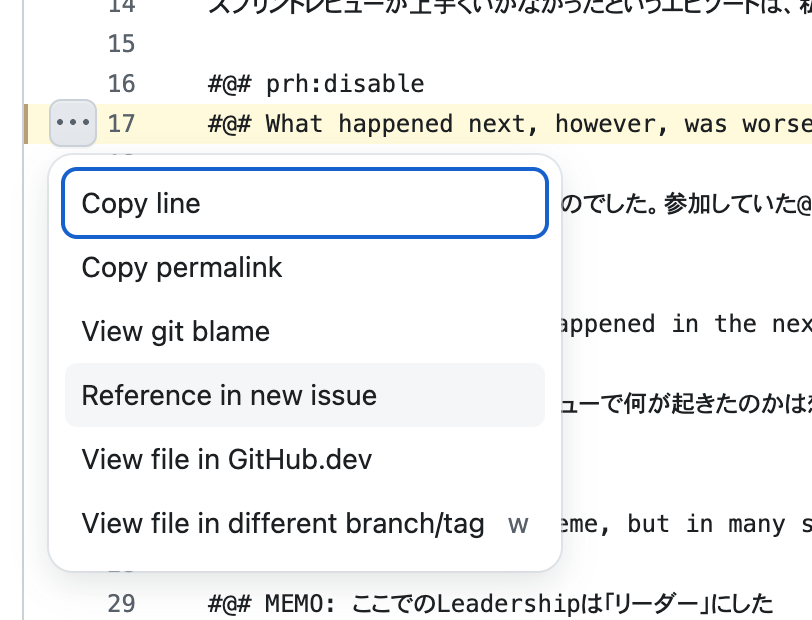

# Accelerating Value: Integrating Lean-Agile Procurement with the Agile Product Operating Model
翻訳プロジェクト

## 翻訳レビューについて
以下のツールを使って翻訳レビューをしていただきます。

### Discordチャンネル
翻訳者と翻訳レビュアーでの諸々のやり取りや雑談はDiscordの専用チャンネルで行わせてください。

 * [Discordチャンネル](https://discord.com/channels/844471845716754442/1428901492244480150)   
   * [招待リンク](https://discord.gg/4c35N48QEM)
 * レビューの進捗: ※「翻訳レビューの開始宣言と終了宣言」参照のこと

### PDFの共有
 * [原文](https://www.scrum.org/resources/accelerating-value-integrating-lean-agile-procurement-agile-product-operating-model)
 * 最新のレビューPDF ◀︎ 翻訳レビュー終了です。本家サイトでの正式公開をお待ちください！
   * 図版の内容もレビューしていただきたいです。
   * 結構、頻繁にPDFは更新されます（日に数回レベル）。

### 翻訳レビューの開始宣言と終了宣言

翻訳レビューいただける場合は、各自のIssueを発行ください。

 * GitHub Issueを起票する
  - Title: お名前（フルネーム）
    （翻訳謝辞にそのままコピペ可能なフルネームをご記入ください）
  - Description: 下記をコピペしてください（※終了予定日は記入してください）
```
- 終了予定日: 2025/10/xx
- [ ] 翻訳レビュー開始
- [ ] 翻訳レビュー完了 
```
  - 開始と完了の際にチェックボックスに✔︎を入れてください

### 翻訳レビューの方法
GitHub Issuesで指摘してください。

 1. 行を選択して、Issueを起票してください（「Reference in new issue」）。
   
 2. Issue "Title"に「読みずらい！〇〇〇〇 → 〇〇●〇がいい」など入れてくれると助かります。内容は、文章の提案があればいただけると助かります！
 3. <del>Labelsにて、適切なものを選択してください（適当でいいです）。</del>
 4. 指摘事項をご記入いただき、［Submit new issue］ボタンを押下してください。

### カンバンプロジェクトはこちら
[カンバン](https://github.com/users/tomoharunagasawa/projects/8/views/1)

### Issueのラベル

だいたい、以下の感じで訳者が付与します！

 * 誤訳: 翻訳についての指摘（誤訳・もっとよい訳し方）
 * 読みやすさの提案: 読みにくい、直訳っぽい、自然と読めなかったなど読みやすさの指摘
 * 誤字脱字: 誤字や脱字など気がついた点を指摘
 * 重複: 以前にご指摘いただいたものと同様のものはこちらにマークします


### 離脱の自由
 * レビュー原稿を見て、内容や質でレビュー困難と思った際は、いつでも遠慮なくご辞退ください
 * スケジュールなどの都合でも、いつでも遠慮なくご辞退ください

---

# 記述の基本ルール
Re:VIEWの原稿は以下を基本としています。

 * 「である調」にしています。

### 用語集は、words.csv
https://github.com/tomoharunagasawa/lean-agile-apom/blob/main/words.csv  
CSV形式。```@<w>{(用語)}```で置換される
